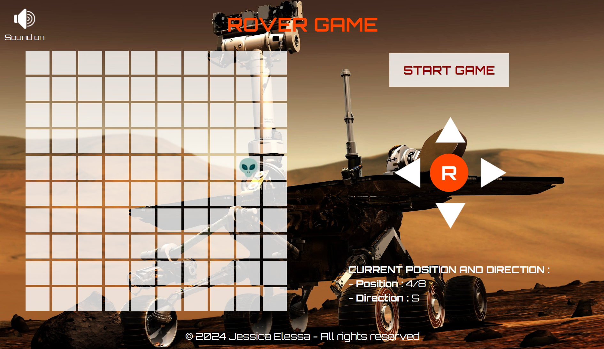

# rover-js

This project is a game that allows a user to pilot a rover on a two-dimensional grid using directional buttons, in order to find an alien in a 30 seconds delay.

## Table of Contents

- [Demo](#demo)
- [Stack](#stack)
- [Screenshot](#screenshot)
- [Features](#features)
- [How to play](#how-to-play)
  - [Commands](#commands)
- [Credits](#credits)
- [Run the project locally](#run-the-project-locally)
- [Contributing](#contributing)
- [Stay Updated](#stay-updated)
- [Contact](#contact)

## Demo

You can play the game [here](https://jesselessa.github.io/rover-js/).

## Stack

This project has been created with HTML, CSS and JavaScript.

## Screenshot

## Features

- Rover left and right rotations.
- Rover forward and backward movements.
- Rover current position and direction.
- Reset of the grid and rover information.
- Timer to launch game.
- Background music.

## How to play

### Commands

Use the visual buttons to move the rover :

-  : Move forward in the current direction.
-  : Move backward in the opposite direction.
-  : Turn to the left.
-  : Turn to the right.
-  : Reset position and orientation.

## Credits

- Backgroud music : ['MARTIAN' by u_4bplvbk4dw](https://pixabay.com/fr/sound-effects/martian-131602/) (License : Pixabay Content License)

## Run the project locally

1. Clone the repository : `git clone https://github.com/jesselessa/rover-js.git`
2. Navigate to the project directory : `cd rover-js`
3. Open the `index.html` file in your preferred browser and start playing.

## Contributing

- If you are interested in contributing, explore the project structure in the HTML, CSS, and JavaScript files.
- Feel free to make improvements, fix bugs, or suggest new features.

## Stay updated

To stay updated with the latest changes, you can pull them from the repository : `git pull origin main`

## Contact

For inquiries, you can contact me via [LinkedIn](https://www.linkedin.com/in/jesselessa/).

---

&copy; 2024, Jessica ELESSA - All rights reserved
