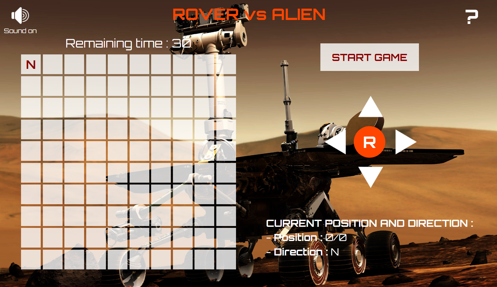

# rover-js

This project is an interactive application that allows you to control a rover on a virtual grid. The goal is to provide a fun experience while practicing basic programming concepts.

## Table of Contents

- [Demo](#demo)
- [Stack](#stack)
- [Screenshot](#screenshot)
- [Features](#features)
- [How to play](#how-to-play)
  - [Commands](#commands)
  - [Reset](#reset)
- [Run the project locally](#run-the-project-locally)
- [Contributing](#contributing)
- [Possible Enhancements](#possible-enhancements)
- [Stay Updated](#stay-updated)
- [Contact](#contact)

## Demo

You can see a live demo of the project [here](https://jesselessa.github.io/rover-js/).

## Stack

This project has been created with HTML, CSS and JavaScript.

## Screenshot

## Features

- Left and right rotations.
- Forward and backward movements.
- Current position and direction.
- Resetting the grid.

## How to play

### Commands

- Use the visual buttons to move the rover :
  -  : Move forward in the current direction.
  -  : Move backward in the opposite direction.
  -  : Turn to the left.
  -  : Turn to the right.
  -  : Reset the position and orientation of the rover.

## Run the project locally

1. Clone the repository : `git clone https://github.com/jesselessa/rover-js.git`
2. Navigate to the project directory : `cd rover-js`
3. Open the `index.html` file in your preferred browser and start playing.

## Contributing

- If you're interested in contributing, explore the project's structure in the HTML, CSS, and JavaScript files.
- Feel free to make improvements, fix bugs, or suggest new features.

## Possible Enhancements

- Animations for Rover movements.
- Enhanced error handling with interactive messages.
- Restricting certain commands based on direction.
- Obstacle mode with randomly placed obstacles on the grid.
- Etc.

## Stay updated

To stay updated with the latest changes, you can pull the latest changes from the repository : `git pull origin main`

## Contact

For inquiries, contact me via [LinkedIn](https://www.linkedin.com/in/jessica-elessa/).

---

&copy; 2024, Jessica ELESSA - All rights reserved
